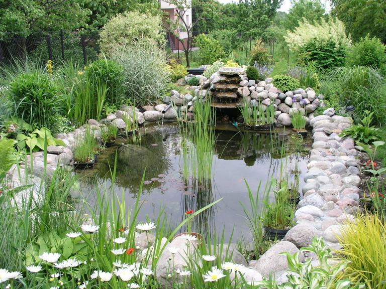

# VGG16 trained on Place365
parsed from [official released caffe model](https://github.com/CSAILVision/places365)

the parsed npy weights (channels first format) can be downloaded [here](https://drive.google.com/file/d/1ir9f6s693e9g9ZnjvB14RnSgBkYYW_96/view?usp=sharing)

the parser and an testing example using keras 2.2.5 and tensorflow 1.14 is included

input:


output:
```
{'fishpond 2': 0.5800485,
 'pond 2': 0.25501078,
 'japanese_garden 2': 0.053529732,
 'botanical_garden 2': 0.04037951,
 'vegetable_garden 2': 0.011974619,
 'formal_garden 2': 0.011510839,
 'roof_garden 2': 0.010852928,
 'fountain 2': 0.009424171,
 'natural 2': 0.0056340345,
 'yard 2': 0.0040317136,
 'marsh 2': 0.0026873273,
 'zen_garden 2': 0.0016492194,
 'patio 2': 0.0015664573,
 'park 2': 0.0010982592,
 'topiary_garden 2': 0.0009744538,
 'swimming_hole 1': 0.0008596056,
 'water 2': 0.0005976151,
 'river 2': 0.0005595065,
 'swamp 2': 0.0005529585,
 'watering_hole 2': 0.00052756345}
 ```
